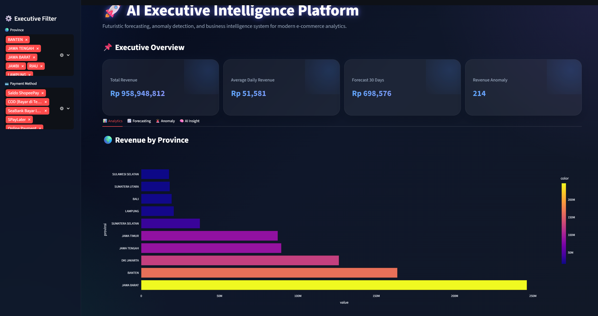
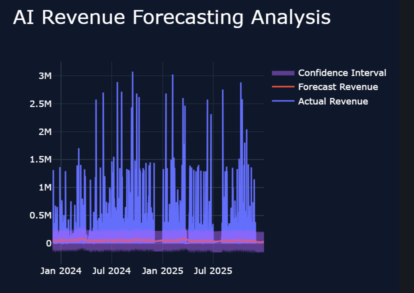
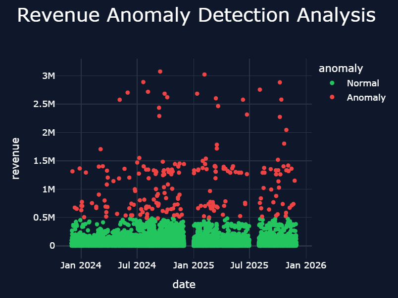
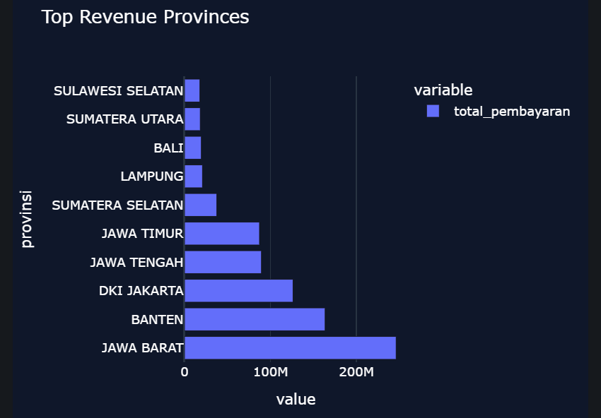

<div align="center">

# Sales Forecasting Intelligence

### Revenue Forecasting · Anomaly Detection · Business Intelligence

**End-to-End Forecasting & Executive Analytics Platform**

<br>


<br>


<br><br>

**Forecast → Detect → Explain → Decide**

<br>

[](https://mwildannabila-core-ai-sales-forecasting-intelligence.streamlit.app/)

</div>

---

## Project at a Glance

<table>
<tr>
<td align="center" width="20%">
<strong>Prophet</strong><br>
Forecasting Model
</td>
<td align="center" width="20%">
<strong>Time Series</strong><br>
Revenue Intelligence
</td>
<td align="center" width="20%">
<strong>Anomaly Detection</strong><br>
Business Monitoring
</td>
<td align="center" width="20%">
<strong>Interactive</strong><br>
Executive Analytics
</td>
<td align="center" width="20%">
<strong>Live</strong><br>
Streamlit Deployment
</td>
</tr>
</table>

> **Project focus:** Transforming historical sales data into forward-looking revenue forecasts, anomaly signals, regional insights, and interactive executive decision support.

---

# Business Problem

Historical dashboards explain **what has already happened**.

Business planning, however, also requires answers to forward-looking questions:

> ### What is likely to happen next, where are unusual revenue patterns emerging, and which business dimensions require attention?

A conventional reporting workflow might stop here:

```text
Historical Data
      │
      ▼
   Dashboard
      │
      ▼
"What happened?"
```

This project extends that workflow:

```text
Historical Sales Data
          │
          ▼
     Business Analytics
          │
          ├──────────────► What happened?
          │
          ▼
      Forecasting
          │
          ├──────────────► What may happen next?
          │
          ▼
   Anomaly Detection
          │
          ├──────────────► What looks unusual?
          │
          ▼
  Decision-Support Layer
                         ► What deserves attention?
```

The result is an interactive analytics platform that connects **descriptive, predictive, and monitoring-oriented analysis**.

---

# Live Application

<div align="center">

[](https://mwildannabila-core-ai-sales-forecasting-intelligence.streamlit.app/)

</div>

The deployed application integrates:

`Executive KPIs` · `Revenue Forecasting` · `Anomaly Detection` · `Regional Analytics` · `Interactive Filtering`

into a single analytical interface.

---

# Executive Intelligence Dashboard

<p align="center">
  
</p>

The executive dashboard provides a consolidated view of historical business performance and forward-looking analytical signals.

### Analytical Layers

<table>
<tr>
<td align="center" width="25%">
<strong>Performance</strong><br>
Revenue & KPI Monitoring
</td>
<td align="center" width="25%">
<strong>Forecast</strong><br>
Future Revenue Trend
</td>
<td align="center" width="25%">
<strong>Anomaly</strong><br>
Unusual Revenue Activity
</td>
<td align="center" width="25%">
<strong>Regional</strong><br>
Geographic Performance
</td>
</tr>
</table>

Interactive filters enable analysis across dimensions such as:


---

# Analytics Architecture

```text
                         SALES DATA
                             │
                             ▼
                    Data Validation
                             │
                             ▼
                  Cleaning & Aggregation
                             │
                             ▼
                     Time-Series Layer
                             │
              ┌──────────────┼──────────────┐
              │              │              │
              ▼              ▼              ▼
        HISTORICAL       FORECASTING      ANOMALY
         ANALYSIS          PROPHET        DETECTION
              │              │              │
              ▼              ▼              ▼
        KPI Trends       Forecast +       Unusual
                         Uncertainty       Activity
              │              │              │
              └──────────────┼──────────────┘
                             ▼
                  BUSINESS INTELLIGENCE
                             │
                             ▼
                    INTERACTIVE UI
                             │
                             ▼
                   DECISION SUPPORT
```

The architecture separates historical reporting, forecasting, and anomaly monitoring while presenting them through a unified executive interface.

---

# Revenue Forecasting

<p align="center">
  
</p>

The forecasting module uses **Prophet** to model historical revenue behavior and estimate future trends.

### Forecasting Outputs

```text
Historical Revenue
       │
       ▼
Temporal Modeling
       │
       ▼
Prophet Forecast
       │
       ├── Expected Trend
       │
       └── Uncertainty Interval
       │
       ▼
Planning Context
```

The forecast provides:

- Estimated future revenue trajectory
- Trend information
- Forecast uncertainty intervals
- Forward-looking analytical context
- Support for planning discussions

---

# Understanding Forecast Uncertainty

A point forecast alone can create a false impression of certainty.

For this reason, the platform also presents an **uncertainty interval** around forecast estimates.

```text
Revenue
   ▲
   │             ╱ ┄ Upper uncertainty
   │           ╱
   │       ──●─── Forecast
   │       ╱
   │     ╱ ┄ Lower uncertainty
   │
   └────────────────────────► Time
```

The interval communicates that future revenue is not known precisely and should be interpreted as a **range of plausible model estimates rather than a guaranteed outcome**.

---

# Revenue Anomaly Detection

<p align="center">
  
</p>

The anomaly-detection layer identifies observations that deviate substantially from expected revenue behavior.

<div align="center">


</div>

Potential anomaly signals may represent:

- Exceptional sales events
- Promotional effects
- Operational irregularities
- Data-quality issues
- Unusual transaction activity
- Changes in underlying business behavior

> **Anomaly ≠ fraud.**  
> The detector identifies statistically unusual observations. Additional business investigation is required to determine their cause.

This distinction is important because unusual revenue behavior should not automatically be characterized as suspicious or fraudulent activity.

---

# Regional Business Intelligence

<p align="center">
  
</p>

Geographic analysis adds another layer to the forecasting system by showing how business performance varies across provinces.

Regional analytics can support questions such as:

```text
Which regions contribute most revenue?
             │
             ▼
Where is performance concentrated?
             │
             ▼
Which regions behave differently?
             │
             ▼
Where should deeper analysis focus?
```

Potential applications include:

- Regional performance benchmarking
- Market prioritization
- Geographic trend monitoring
- Operational planning
- Market expansion analysis

---

# Three Layers of Intelligence

<table>
<tr>
<td width="33%" valign="top">

### 01 · Descriptive

**What happened?**

Historical revenue, KPIs, regional performance, and business segmentation.

</td>
<td width="33%" valign="top">

### 02 · Predictive

**What may happen next?**

Revenue forecasting and uncertainty estimation using historical temporal patterns.

</td>
<td width="33%" valign="top">

### 03 · Monitoring

**What looks unusual?**

Statistical anomaly detection highlights observations that warrant additional investigation.

</td>
</tr>
</table>

Together, these layers provide a more complete analytical view than historical reporting alone.

---

# From Forecast to Decision Support

```text
                   BUSINESS PERFORMANCE
                           │
                           ▼
                     Historical Data
                           │
          ┌────────────────┼────────────────┐
          ▼                ▼                ▼
      Revenue Trend    Forecast Signal   Anomaly Signal
          │                │                │
          ▼                ▼                ▼
      Performance       Planning         Investigation
        Review          Context            Priority
          │                │                │
          └────────────────┼────────────────┘
                           ▼
                    BUSINESS DECISION
                           │
                           ▼
                    Outcome Monitoring
```

The project therefore treats forecasting as one component within a broader **business intelligence and decision-support workflow**.

---

# Decision-Support Framework

| Analytical Signal | Potential Business Use |
|---|---|
| Forecasted revenue growth | Capacity and resource planning |
| Forecasted revenue decline | Performance review and scenario analysis |
| Wide forecast uncertainty | More cautious planning assumptions |
| Positive revenue anomaly | Investigate campaigns, events, or unusual demand |
| Negative revenue anomaly | Review operational or demand-side issues |
| Regional concentration | Market and resource prioritization |
| Regional underperformance | Deeper diagnostic analysis |

> These are **potential analytical applications**, not measured business outcomes from production deployment.

---

# Key Technical Challenge

### Challenge

Building a useful forecasting application requires more than plotting a future trend.

Forecasts must be presented together with:

`Historical Context` · `Uncertainty` · `Anomalies` · `Business Dimensions`

Otherwise, users may interpret a model estimate without understanding the context surrounding it.

### Approach

The platform combines:

1. Data preparation and aggregation.
2. Historical revenue analytics.
3. Prophet-based forecasting.
4. Forecast uncertainty visualization.
5. Statistical anomaly detection.
6. Regional and transactional segmentation.
7. Interactive Plotly visualization.
8. Streamlit-based decision-support interface.

This creates an analytical workflow in which **prediction remains connected to business context**.

---

# Technology Ecosystem

<div align="center">


&nbsp;&nbsp;&nbsp;

&nbsp;&nbsp;&nbsp;

&nbsp;&nbsp;&nbsp;

&nbsp;&nbsp;&nbsp;

&nbsp;&nbsp;&nbsp;

&nbsp;&nbsp;&nbsp;


<br><br>

`Python` · `Pandas` · `NumPy` · `Prophet` · `SciPy` · `Plotly` · `Streamlit`

</div>

---

# Technical Stack

| Layer | Technology |
|---|---|
| **Programming** | Python |
| **Data Processing** | Pandas · NumPy |
| **Forecasting** | Prophet |
| **Statistical Analysis** | SciPy |
| **Visualization** | Plotly |
| **Application** | Streamlit |
| **Deployment** | Streamlit Community Cloud |

---

# Skills Demonstrated

<table>
<tr>
<td width="33%" valign="top">

**Data Science**

- Time-Series Analysis
- Forecasting
- Anomaly Detection
- Statistical Analysis

</td>
<td width="33%" valign="top">

**Business Intelligence**

- KPI Analytics
- Regional Analysis
- Executive Reporting
- Interactive Filtering

</td>
<td width="33%" valign="top">

**Analytics Engineering**

- Data Processing
- Interactive Visualization
- Streamlit Development
- Cloud Deployment

</td>
</tr>
</table>

---

# Analytical Limitations

The application is an **analytics portfolio project and deployed demonstration**, not a validated production forecasting system.

### Forecast dependency

Forecast quality depends on the amount, quality, and temporal structure of the historical data.

### Structural changes

Unexpected market events, pricing changes, operational disruptions, or other external factors may cause future observations to diverge from historical patterns.

### Anomaly interpretation

Statistical anomalies indicate unusual observations but do not identify their underlying cause.

### External drivers

A univariate or limited-feature forecasting setup may not fully represent external drivers such as:

- promotions,
- macroeconomic conditions,
- seasonality changes,
- competitor activity,
- pricing strategy,
- holidays,
- or supply constraints.

### Business validation

Forecast-driven recommendations should be validated against domain knowledge and actual business constraints before operational use.

---

# Future Development

The platform can be extended through:

- Forecast backtesting
- Rolling cross-validation
- MAE / RMSE / MAPE evaluation
- Additional forecasting baselines
- XGBoost or LightGBM time-series models
- External regressors
- Holiday and campaign features
- Automated anomaly alerts
- Scenario forecasting
- Cloud database integration
- Scheduled data pipelines
- Model drift monitoring
- Automated executive reports

A particularly important next step is establishing a formal benchmark:

```text
Naive Baseline
      │
      ├── Moving Average
      ├── Seasonal Baseline
      ├── Prophet
      └── ML Forecasting
              │
              ▼
      Backtesting Evaluation
              │
              ▼
      Evidence-Based Selection
```

This would make model selection empirically defensible rather than relying on a single forecasting approach.

---

# Repository Structure

```text
sales-forecasting-intelligence/
│
├── assets/
│   ├── dashboard-overview.png
│   ├── forecasting-analysis.png
│   ├── anomaly-detection.png
│   └── revenue-by-province.png
│
├── data/
├── notebooks/
├── src/
│
├── app.py
├── requirements.txt
├── LICENSE
└── README.md
```

---

# Run Locally

```bash
git clone <repository-url>
cd sales-forecasting-intelligence

pip install -r requirements.txt
streamlit run app.py
```

---

# Project Summary

| Dimension | Implementation |
|---|---|
| **Business Problem** | Revenue forecasting and business monitoring |
| **Primary Task** | Time-Series Forecasting |
| **Forecasting Model** | Prophet |
| **Uncertainty** | Forecast Interval |
| **Monitoring** | Statistical Anomaly Detection |
| **Business Analytics** | Regional & Transactional Analysis |
| **Visualization** | Interactive Plotly |
| **Application** | Streamlit |
| **Deployment** | **Live** |
| **Primary Value** | Forecasting + Monitoring + Decision Support |

---

# Explore the Project

<div align="center">

[](https://mwildannabila-core-ai-sales-forecasting-intelligence.streamlit.app/)

</div>

---

# Author

**Muhammad Wildan Nabila**  
Bachelor of Informatics · Universitas Muhammadiyah Malang

<div align="left">


</div>

---

<div align="center">

### Historical Sales → Forecasting → Anomaly Signals → Business Intelligence

**Time Series · Predictive Analytics · Interactive BI · Decision Support**

</div>
